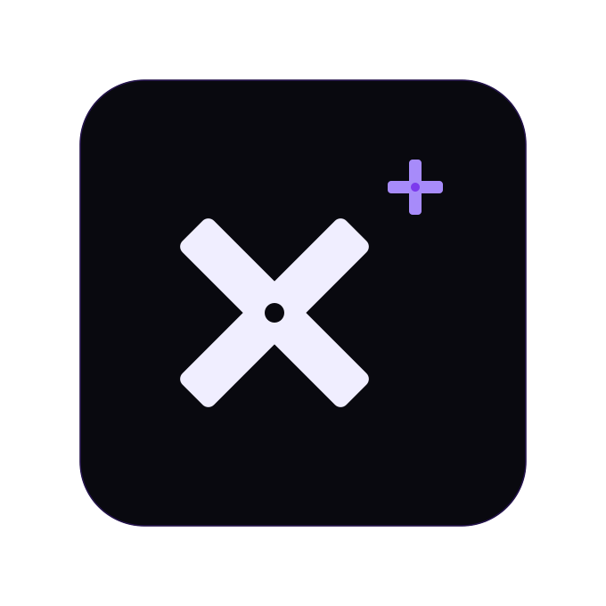

<div align="center">



[](https://github.com/Reaudacity/XPlus/actions/workflows/build-main.yml) [](https://github.com/Reaudacity/XPlus/actions/workflows/build-packages.yml)   


# X+

**A server-first XML markup language that transpiles to HTML**

X+ lets you write pages in a structured XML dialect, run them on a Node.js server with real API routes, and export them as plain static HTML — all from the same source files.

</div>

---

## Why X+

Most frontend tools start from JavaScript and bolt on HTML. X+ starts from HTML and bolts on exactly what you need: server-side API routes, reusable components, hot reload, and a plugin system — without a virtual DOM, a bundler config, or a build graph to reason about.

- Write pages as XML. Get HTML out.
- Run server routes in sandboxed Node VMs without touching Express directly.
- Components are resolved at parse time — zero runtime overhead, zero client-side JS required.
- One source tree for both dev server and static export.

---

## Install

```bash
npm install -g xplus
```

Or run without installing:

```bash
npm create xplus-app
```

**Requirements:** Node.js 18+

---

## Quick start

```bash
xplus init my-site # npm create xplus-app
cd my-site
npm install
x+ dev          # start the dev server on http://localhost:3000
```

---

## Project structure

```
my-site/
  xplus.yml            # project configuration
  app/
    page.xp            # → route: /
    about/
      page.xp          # → route: /about
    dashboard/
      page.xp          # → route: /dashboard
      404.xp           # → custom 404 for /dashboard/**
    404.xp             # → custom 404 for all unmatched routes
  components/
    navbar.xp          # → <Navbar /> usable in any page
    loginform.xp       # → <LoginForm />
  api/
    hello.ts           # → xscript handler (TypeScript or JavaScript)
  assets/
    logo.png           # → served at /logo.png
    favicon.svg        # → used as favicon (overrides the default X+ logo)
  .xp/                 # internal workspace — do not edit
```

`page.xp` files are the entry point for each route. The directory name becomes the URL path. `404.xp` files are scoped — `dashboard/404.xp` only handles 404s under `/dashboard`, while `app/404.xp` is the global fallback.

---

## Pages

Pages are XML files with a `<XPlusPage>` root element:

```xml
<?xml version="1.1" encoding="UTF-8"?>

<XPlusPage title="Home" description="My homepage" style="styles/home.css">

  <h1>Hello from X+</h1>
  <p>This page is rendered by the X+ runtime.</p>

  <!-- Components are resolved at parse time, no imports needed -->
  <Navbar />
  <LoginForm />

  <!-- xscript registers a server-side API route -->
  <xscript path="/api/hello" file="api/hello.ts" method="GET"></xscript>

</XPlusPage>
```

The `style=` attribute links a CSS file. In dev/prod server mode the CSS is served as a linked file. In `xplus build` it is inlined.

---

## Components

Components live in the `components/` directory. Any `.xp` file there is automatically registered globally — no imports needed in pages.

```xml
<?xml version="1.1" encoding="UTF-8"?>

<XPlusComponent name="Navbar" style="styles/navbar.css">
  <nav>
    <a href="/">Home</a>
    <a href="/about">About</a>
  </nav>
</XPlusComponent>
```

Use it anywhere:

```xml
<Navbar />
```

Components can use other components. Circular references are caught at parse time with a clear error. Styles declared on a component are scoped to wherever the component is inlined.

---

## xscript — server API routes

`xscript` is the only X+-only tag. It registers an Express route backed by a TypeScript or JavaScript handler file, run inside a Node VM sandbox per request.

```xml
<xscript path="/api/users" file="api/users.ts" method="GET"></xscript>
<xscript path="/api/users" file="api/users.ts" method="POST"></xscript>
```

**Handler file** (`api/users.ts`):

```typescript
import { Request, Response } from "express";

export default function handler(req: Request, res: Response) {
  res.json({ users: [] });
}
```

Or inline style (plain JavaScript, no export needed):

```javascript
// api/echo.js
res.json({ body: req.body });
```

**Sandbox globals:** `req`, `res`, `next`, `console`, `Buffer`, `fetch`, `setTimeout`, `require`, `module`, `exports`, `__filename`, `__dirname`, `process.env`

Not available: `process.exit`, unconstrained file system access (use `require("fs")` explicitly).

xscript routes are registered in Phase 1, before any page route, so API endpoints are always reachable regardless of page load order. They are invisible in `xplus build` output — they have no HTML representation.

---

## Configuration

`xplus.yml` at the project root:

```yaml
name: My Site
description: Built with X+

server:
  port: 3000

router:
  directory: app        # where page.xp files live

components:
  directory: components # where component .xp files live

plugins:
  - "xplus:tailwindcss" # built-in plugin
  - "xplus:meta"        # built-in plugin
  - "./plugins/my.ts"   # local plugin file
  - "some-npm-package"  # npm plugin

# Plugin-specific options
pluginOptions:
  tailwindcss:
    cdn: true           # force CDN instead of local JIT
```

---

## Assets

Put files in `assets/` and they are served at `/`:

```
assets/logo.png   →  /logo.png
assets/font.woff  →  /font.woff
assets/favicon.svg →  /favicon.svg  (becomes the page favicon)
```

If no favicon is found in `assets/`, X+ serves its own logo as the default favicon at `/favicon.ico`. Drop any `favicon.*` file into `assets/` to override it.

---

## CLI

### Scaffold

```bash
xplus init                  # scaffold in current directory
xplus init my-site          # scaffold into a new directory
xplus init --yes            # skip prompts, use all defaults

xplus new page about        # creates app/about/page.xp
xplus new page blog/post    # creates app/blog/post/page.xp
xplus new handler users     # creates api/users.ts, prompts for method
xplus new handler users --js  # JavaScript instead of TypeScript
```

### Development

```bash
xserver                     # start dev server (alias for x+ dev)
xplus dev                   # same — HMR, error overlay, X++ panel
xplus serve                 # production server (no HMR, no dev tools)
```

### Build

```bash
xplus build                 # transpile all pages to dist/
xplus build --out public    # custom output directory
```

### Utilities

```bash
xplus check                 # validate all .xp files, report errors
xplus routes                # list all page routes and API endpoints
xplus info                  # show project config and workspace status
xplus clean                 # clear the .xp/ internal workspace
xplus clean --force         # skip confirmation

xplus -v                    # print version
xplus -h                    # show help
```

---

## Dev server features

### Hot module reload

The dev server watches every file in the project. Saving any file triggers a browser reload. Editing `xplus.yml` triggers a full server restart with the new config — the CLI spawn-loop handles this automatically, no manual restart needed.

### Error overlay

Build errors appear as a draggable overlay in the browser with the error message and full stack trace. Dismiss with the ✕ button or fix the error and save — the page reloads automatically.

### X++ panel

A floating development panel appears in the bottom-left corner of every dev page. Toggle with **Ctrl+Shift+X**.

Options:
- **Error overlay** — show or hide the error overlay
- **Collapse panel** — shrinks to a small pill; click or use the keybinding to restore

Settings persist to `~/.xp/settings.json` across sessions and projects.

---

## Plugins

### Built-in plugins

Enable in `xplus.yml` with the `xplus:` prefix:

| Plugin | Description |
|---|---|
| `xplus:tailwindcss` | Injects Tailwind CSS. Uses local JIT if `tailwindcss` is installed, CDN Play script otherwise |
| `xplus:meta` | Auto-generates Open Graph and Twitter Card meta tags from each page's title and description |

### Custom plugins

Local file:

```typescript
// plugins/myPlugin.ts
import { XPlusPlugin } from "xplus";

export default {
  name: "my-plugin",

  setup(ctx) {
    ctx.log("Plugin loaded");
  },

  async transformHTML(html, route) {
    return html.replace("</head>", `<link rel="stylesheet" href="/extra.css"></head>`);
  },
} satisfies XPlusPlugin;
```

Register in `xplus.yml`:

```yaml
plugins:
  - "./plugins/myPlugin.ts"
```

### Plugin hooks

| Hook | When it runs | Use for |
|---|---|---|
| `setup(ctx)` | Once at startup | Validate config, init external connections |
| `onComponentsReady(registry)` | After component scan | Register synthetic components |
| `transformDocument(doc, route)` | Each time a page is parsed | Mutate the document tree |
| `transformHTML(html, route)` | After `buildHTML()` | Inject scripts, styles, meta tags |

---

## The `.xp/` directory

X+ maintains an internal workspace at `.xp/` in your project root:

```
.xp/
  runtimeOnly/
    transpile/    ← xscript TS handlers transpiled to JS
  packed/         ← client-side esbuild bundles
  plugins/        ← local plugin files transpiled to JS
  .gitignore      ← auto-generated, ignores everything inside
```

This directory is managed entirely by the CLI. Never edit it manually. Add `.xp/` to your `.gitignore` (the scaffold does this automatically).

---

## How build works

`xplus build` produces a fully static site:

1. Scans `app/` for `page.xp` files
2. Parses each file — inlining all components, resolving all style paths
3. Runs `transformDocument` and `transformHTML` plugin hooks
4. Bundles any `<script src="...">` references via esbuild
5. Inlines CSS from `style=` attributes (running PostCSS+Tailwind if available)
6. Writes `index.html` files to `dist/` mirroring the URL structure
7. Copies `assets/` into `dist/`

xscript nodes are silently skipped — they only exist for the server runtime.

---

## License

Copyright 2025 AbdullahCXD

Permission is hereby granted, free of charge, to any person obtaining a copy of this software and associated documentation files (the “Software”), to deal in the Software without restriction, including without limitation the rights to use, copy, modify, merge, publish, distribute, sublicense, and/or sell copies of the Software, and to permit persons to whom the Software is furnished to do so, subject to the following conditions:

The above copyright notice and this permission notice shall be included in all copies or substantial portions of the Software.

THE SOFTWARE IS PROVIDED “AS IS”, WITHOUT WARRANTY OF ANY KIND, EXPRESS OR IMPLIED, INCLUDING BUT NOT LIMITED TO THE WARRANTIES OF MERCHANTABILITY, FITNESS FOR A PARTICULAR PURPOSE AND NONINFRINGEMENT. IN NO EVENT SHALL THE AUTHORS OR COPYRIGHT HOLDERS BE LIABLE FOR ANY CLAIM, DAMAGES OR OTHER LIABILITY, WHETHER IN AN ACTION OF CONTRACT, TORT OR OTHERWISE, ARISING FROM, OUT OF OR IN CONNECTION WITH THE SOFTWARE OR THE USE OR OTHER DEALINGS IN THE SOFTWARE.
